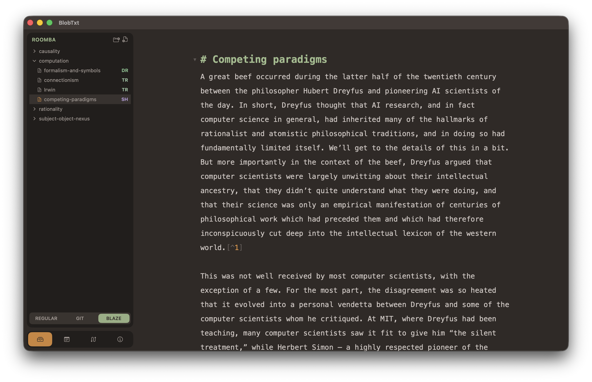

# BlobTxt

## 1. About
### 1.1. What is BlobTxt?

BlobTxt is a text editor. It is intended for writers and researchers. It is a hybrid design that combines many things, notably including the following:

1. Quick and fragmentary thinking afforded by a notes app;
2. Careful organization of drafts and longer sessions of focused writing, typically done in a conventional document editor (e.g., MS Word or Apple Pages);
3. The distinct oragnization chain of a "repository" used by developers.

This is done through a combination of three things. 

**First, the Markdown format.** With enough extensions, it's a powerful tool that can functionally replace the DOCX format for most people who do writing-intensive work. With support for CSS-aided printing and file exports, the capabilities become even larger. 

**Secondly, git integration.** Git-based version control is industry standard for developers and computer scientists for a reason. Moreover, git is not a solution; it is a set of tools. A hacksaw is a good tool; it works just as well for cutting canvas at an artist's shop as it does for cutting metal at the hardware store. Good sofware comes in a similar shape and git is one of them.

**Thirdly, integration with a custom pipelining tool.** Sometimes, a writer or researcher wants to track not the *version history* of a file in the software sense, but its *development stage*, where a piece is understood to be in a lifecycle (e.g., loose note, trying an idea, active draft, or in review). Git is not great for this kind of tracking. So, I made a tool just for this purpose: [blaze](https://github.com/guruk-cat/blaze), named after the bygone practice of trailblazing.

(From left to right: Sidebar showing the file navigator panel, with blaze-tracking mode. Text editor showing a Markdown blob. All using the default `stone` color palette.)

### 1.2. Authors and Credits

The app was designed by June Jung. The codebase was vibe-coded with Claude by Anthropic.

The actual text editor portion of the app is built on [CodeMirror 6](https://codemirror.net). The editor is wrapped inside the app through Apple's `WKWebView` library.

### 1.3. Versions and Install

Alpha 1.0 version is available in `misc_resources/distro/` as a compressed `.app` file. Unzip it and move it to your `/Applications/` folder.

Please be aware that BlobTxt has undergone a major refactor from the previous architecture, FishTxt. Some of the features are yet to be rebuilt, and new features are still being planned. The current version is very minimal.
