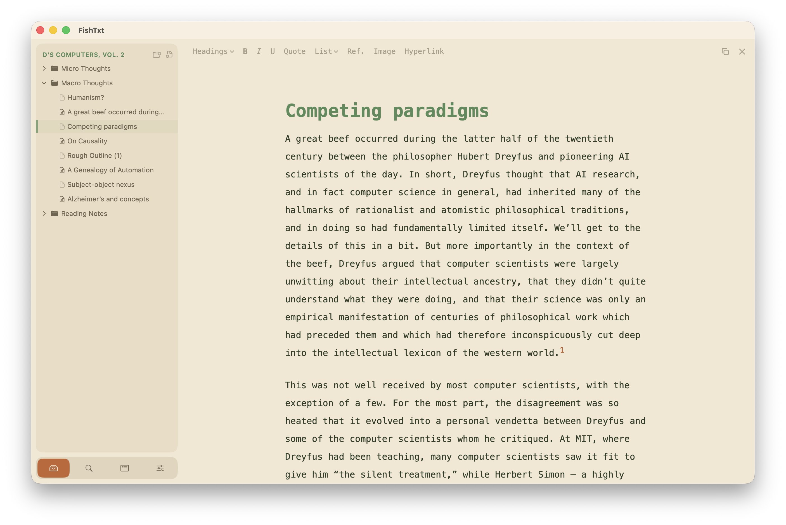
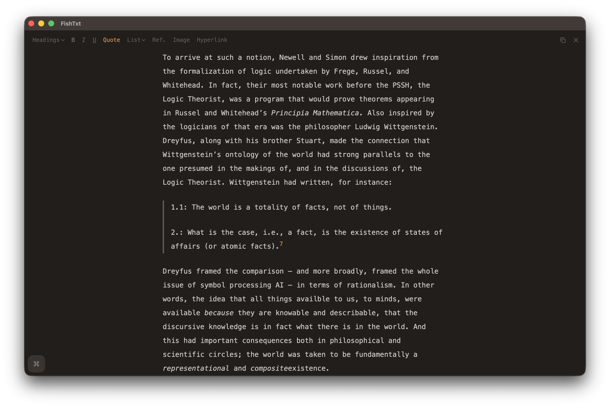
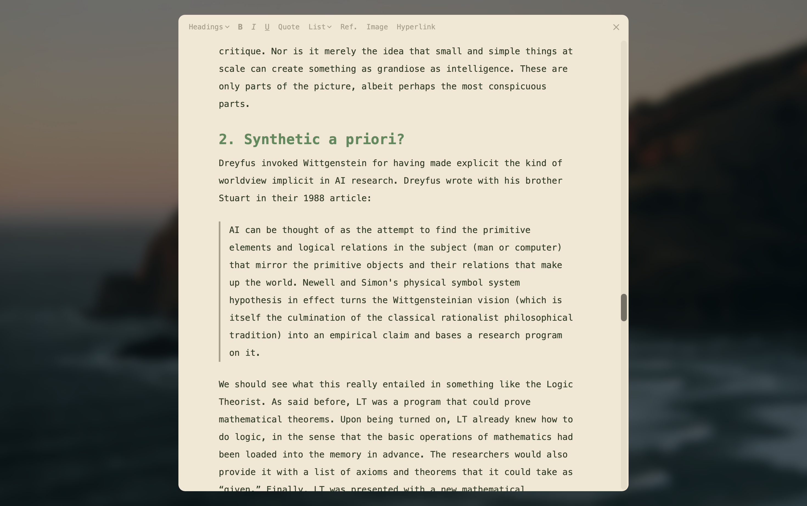

# BlobTxt

## About

BlobTxt is a hybrid between a notetaking app and a conventional word document. It is a light-weight rich text editor that is intended to support two distinct kinds of work in a single environment:

1. Rapid brainstorming, piece-wise drafting, and jumping between ideas
2. Careful organization of drafts, and longer sessions of focused writing.

When writing a long article that covers many sources and topics, it is hard to keep everything coherent in a single word document right from the start. Conversely, it is hard to develop a holistic vision only through a form of notetaking, whether it be in a physical notebook, a dedicated notes app, or — the worst but perhaps the simplest — another word document where you just throw everything in. Thus, most people require some combination of the two kinds of tools. BlobTxt was designed to be exactly that kind of combination: a set of tools that you can use from the very beginning of a project all the way to the first or second draft. 

## Screenshots

**Editor and sidebar** (shown in the default `paper` color palette):

**Editor without sidebar** (shown in an alternative `stone` color palette):

**Focus mode in fullscreen:**

## Credits

The app was designed by June Jung, and the codebase was vibe-coded with Claude by Anthropic.

Much of BlobTxt has been written from scratch, but the actual text editor uses [TipTap](https://tiptap.dev/docs/editor/getting-started/overview), an open-source rich text editor framework. Moreover, the [tiptap-footnoes](https://github.com/buttondown/tiptap-footnotes) extension is used for adding in-line references and notes. The editor runs in a javascript environment that is wrapped inside the app through Apple's `WKWebView` library.

## Versions and Install

BlobTxt is currently undergoing a file format migration, from JSON (read and written by TipTap) to Markdown with some custom parsing for footnotes.

A macOS `.app` file is available in the `distro/` folder. This is the Alpha (10.0) version, built and tested on macOS Tahoe. You'll have to uncompress (unzip) the file. I recommend manually moving this into your `/Applications/` folder; an installation `.dmg` file is not available yet.

## File Persistence

Project files are stored in `~/Documents/BlobTxt/`, and user settings are stored through `@AppStorage`.
