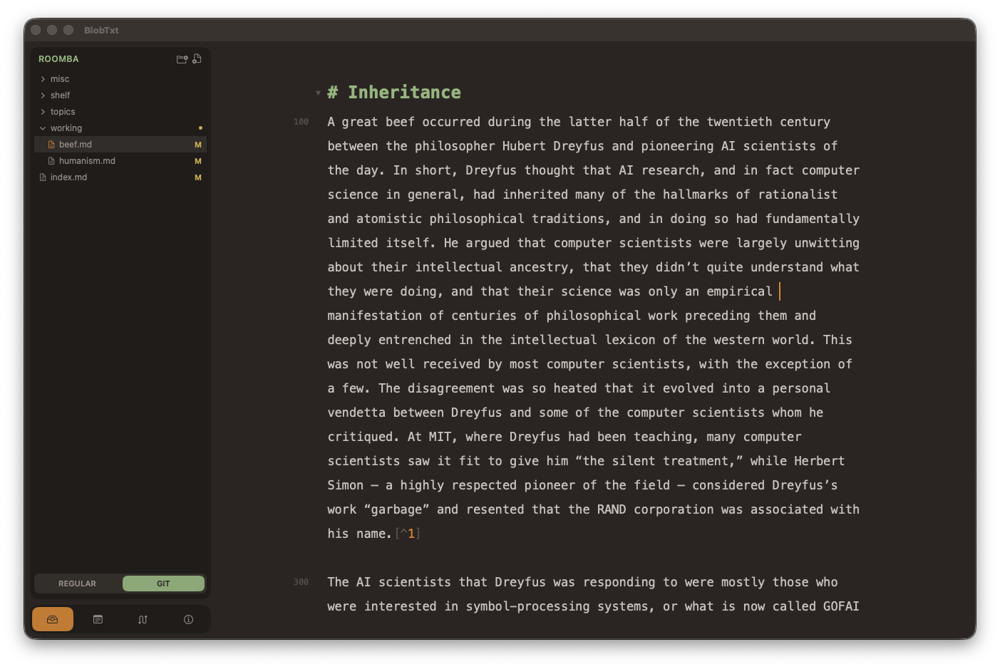

# BlobTxt

## 1. About
### 1.1. What is BlobTxt?

BlobTxt is a text editor. It is intended for writers and researchers. It is a hybrid design that combines many things, notably including the following:

1. Quick and fragmentary thinking afforded by a notes app;
2. Careful organization of drafts and longer sessions of focused writing, typically done in a conventional document editor (e.g., MS Word or Apple Pages);
3. The distinct oragnization chain of a "repository" used by developers.

BlobTxt uses the Markdown file format for its "blobs." With a handful of parser extensions and app features, Markdown can be a strong replacement for DOCX-based formats. It comes with the following benefits, all of which BlobTxt is built for:

1. Consistent and simple UI/UX across writings of varying purposes and lengths;
2. Easy version control through Git integration with your editor;
3. Flexibility over file export formats;
4. Having scripts do the formatting for you when you export.

Of course, if you need to do heavy formatting work (perhaps you are submitting a graduation thesis), you'll eventually need a conventional document editor. But BlobTxt will be better for getting from zero to your first draft (or so goes the intention) and you can always export to a different file format when you need to.

### 1.2. Authors and Credits

The app was designed by June Jung. The codebase was vibe-coded with Claude by Anthropic.

The actual text editor portion of the app is built on [CodeMirror 6](https://codemirror.net). The editor is wrapped inside the app through Apple's `WKWebView` library.

### 1.3. Versions and Install

Build 0.2.0 is available in `misc_resources/distro/` as a compressed `.app` file. Unzip it and move it to your `/Applications/` folder.

Please be aware that BlobTxt has undergone a major refactor from the previous architecture, FishTxt. Some of the features are yet to be rebuilt, and new features are still being planned. The current package is very minimal.
